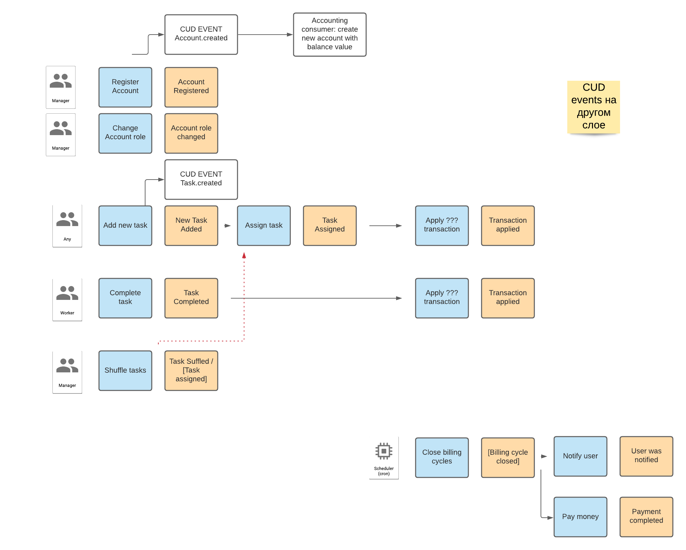
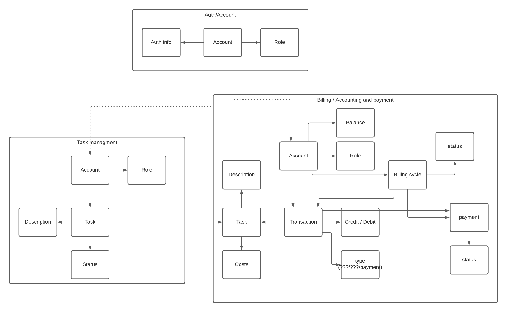

# async-architecture-course

Репозиторий с домашками по курсу Асинхронная архитектура

##Бизнес команды:

1. Таск-трекер должен быть отдельным дашбордом и доступен всем сотрудникам
    - Actor: Account
    - Command: LoginToTaskTracker
    - Data: credentials
    - Event: accounts.Logined
2. Новые таски может создавать кто угодно 
  -
    - Actor: Account
    - Command: CreateNewTask
    - Data: task description
    - Event: tasks.Created
-
    - Actor: Account
    - Command: AssignTask
    - Data: task public id + account id
    - Event: tasks.Assign

4. Менеджеры или администраторы должны иметь кнопку «заассайнить задачи»
    - Actor: Account
    - Command: ReassignAllTasks
    - Data: account id
    - Event: tasks.AllReassigned
5. Сотрудник может отметиь задачу выполненной
    - Actor: Account
    - Command: CompleteTask
    - Data: account id + task id
    - Event: tasks.Completed
6. Менеджеры могут регистрировать аккаунты
    - Actor: Manager'sAccount
    - Command: RegisterAccount
    - Data: auth info
    - Event: account.Registered
7. Менеджеры могут менять роль других аккаунтов
    - Actor: Manager's Account
    - Command: ChangeAccountRole
    - Data: account id + new role
    - Event: account.RoleChanged
8. В конце каждого дня необходимо производить выплаты
    - Actor: Billing scheduler
    - Command: CloseBillingCycle
    - Data: 
    - Event: billing.CycleClosed
9. После ассайна задачи необходимо списать деньги с сотрудника
10. После закрытия таски сотрудником необходим начислить ему бонус за закрытие задачи
    

## Queries
1. Каждый сотрудник должен иметь возможность видеть в отдельном месте список заассайненных на него задач 

## Event storming

## Data model 

